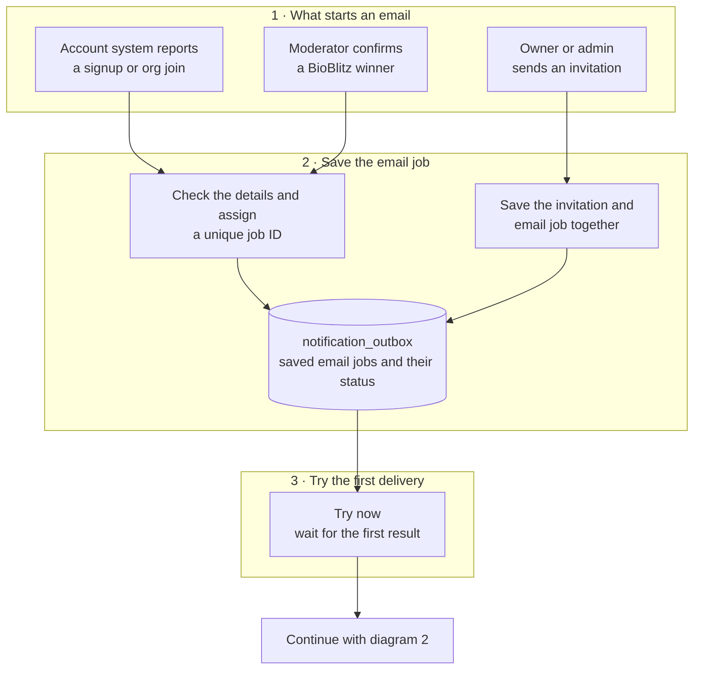
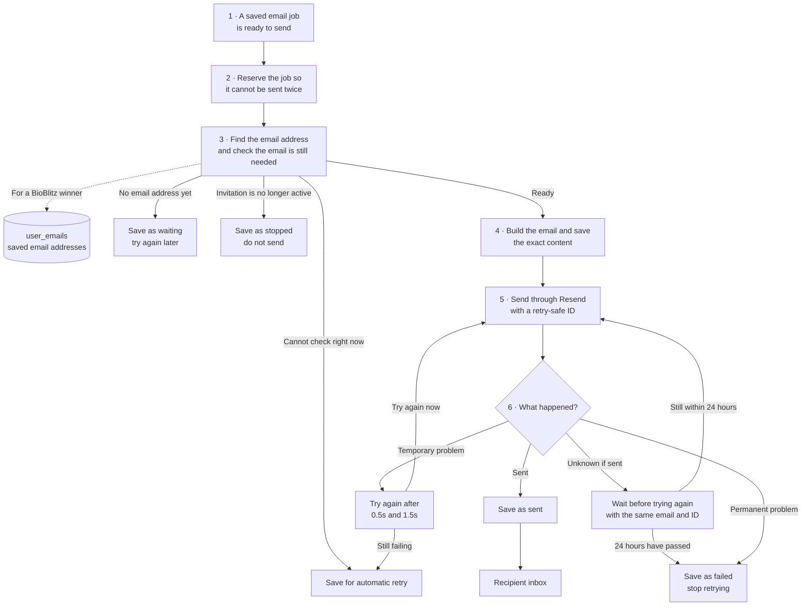
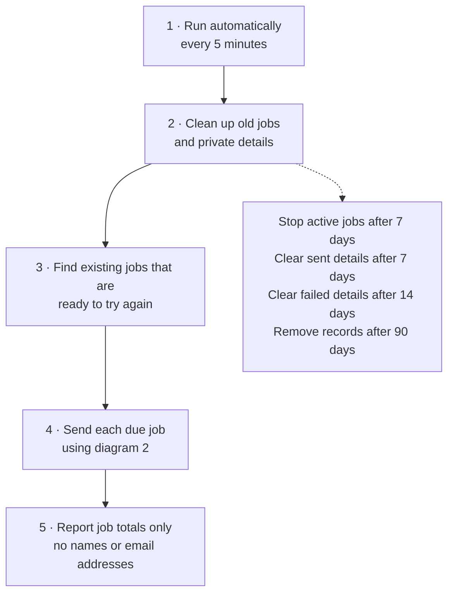
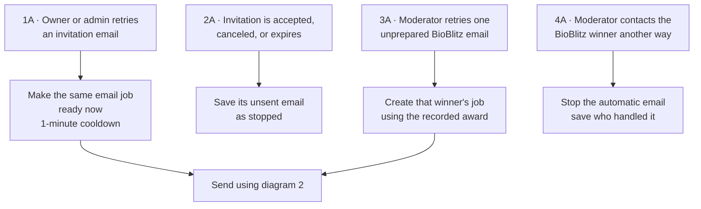

# Email notification system

The notification outbox durably coordinates email delivery. The application writes notification intent through database RPCs, workers claim rows, render and freeze a provider request, then record a terminal or retryable outcome.

## How email notifications work

The diagrams below split the system into four smaller flows: creating a job, sending one email, automatic recovery, and manual actions.

### 1. How an email job is created



### 2. How one email is sent

The main sending path runs downward. Problems branch off where they happen.



`Waiting`, `Stopped`, `Later`, `Sent`, and `Failed` are statuses saved in `notification_outbox`.

### 3. How automatic recovery works



The cron never discovers historical events or creates missing notification jobs. Producers create jobs only as the corresponding signup, membership, invitation, or moderator award action happens.

### 4. How manual actions work



BioBlitz email jobs are created when a moderator issues each winner badge. If setup fails, the moderator can retry that one recorded prize from the Past winners controls. There is no bulk or background reconciliation of earlier awards.

## Source of truth

`supabase/migrations/20260805235500_notification_outbox.sql` is the canonical schema and RPC definition. The database contract in `tests/database/notification-outbox-contract.sql` asserts the exact ordered column names, types, nullability, defaults, RPC signatures, permissions, and transition behavior.

This baseline was canonicalized before any migration-runner deployment. The existing non-production database was configured through SQL Editor, which does not add versions to `supabase_migrations.schema_migrations`. Do not rewrite this baseline after its version has been recorded. An environment that has recorded an older form must be reset or have its migration history explicitly repaired before using this migration tree.

The table has 36 columns, grouped by responsibility:

| Responsibility | Columns |
| --- | --- |
| Identity and deduplication | `id`, `event_key_hash`, `input_fingerprint_hash` |
| Notification and render inputs | `event_type`, `payload`, `source_id`, `recipient_did`, `recipient_email`, `template_key`, `locale` |
| Frozen provider request | `frozen_from`, `frozen_to`, `frozen_subject`, `frozen_html`, `frozen_text` |
| Queue scheduling and lease ownership | `status`, `next_attempt_at`, `processing_run_count`, `provider_attempt_count`, `locked_until`, `processing_token`, `claimed_from_status` |
| Provider result and ambiguity safety | `provider_call_phase`, `provider_call_is_ambiguous_retry`, `provider_id`, `provider_idempotency_key`, `provider_idempotency_expires_at` |
| Diagnostics and operator actions | `last_error_code`, `last_error_summary`, `last_manual_retry_at`, `manual_retry_count`, `manual_handled_at`, `manual_handled_by` |
| Lifecycle | `terminal_at`, `created_at`, `updated_at` |

## State markers

The schema derives state from fields that are required for delivery rather than storing redundant timestamps:

- `frozen_from IS NOT NULL` means the provider request is frozen. The database requires all five `frozen_*` fields to be either set together or `NULL` together.
- `template_key IS NULL` means private delivery data has been cleared from a terminal row. The private-data constraint requires all other private and retry fields to be cleared with it.
- `provider_call_phase = 'in_flight'` means a provider call may have happened. `provider_idempotency_expires_at` is its original safety deadline.
- `provider_call_is_ambiguous_retry` distinguishes a reclaimed, previously uncertain transmission. A retry must not extend `provider_idempotency_expires_at`.

There is intentionally no `delivery_mode`, `frozen_at`, `redacted_at`, `provider_call_started_at`, or `ambiguous_since` column.

## Counters

- `processing_run_count` increments whenever a worker successfully claims the row.
- `provider_attempt_count` increments only when `notification_outbox_begin_provider_call` starts a provider transmission.
- `manual_retry_count` and `last_manual_retry_at` support operator-initiated invitation retries and their cooldown.
- `manual_handled_at` and `manual_handled_by` audit when a moderator replaces automatic BioBlitz delivery with manual follow-up.

## Mutation boundary

Application code must not update outbox rows directly. `service_role` can read the table but state changes go through `notification_outbox_*` RPCs. Browser roles cannot read the table or execute its RPCs.

The enqueue contract is the Resend-only 10-argument function:

```sql
notification_outbox_enqueue(
  p_event_key text,
  p_event_type text,
  p_payload jsonb,
  p_source_id text,
  p_recipient_did text,
  p_recipient_email text,
  p_template_key text,
  p_locale text,
  p_provider_idempotency_key text,
  p_next_attempt_at timestamptz
)
```

`EMAIL_DISABLED` is the only email-delivery switch. When it is `true`, producers and drains do not run. Otherwise delivery uses Resend.

## Retention

Active work expires after seven days. Sent rows clear private delivery data seven days after becoming terminal; dead rows clear it after fourteen days. Cleared terminal tombstones preserve event deduplication until cleanup deletes the row 90 days after creation.

## Database prerequisites

The canonical migration requires these private tables in the same Supabase project:

- `public.cgs_group_invitations`, defined by `docs/cgs-group-invitations.sql`;
- `public.user_emails`, defined by `docs/user-emails.sql`.

The migration checks every required prerequisite column and fails with corrective guidance when the tables are missing or incomplete. For a new environment, apply both prerequisite SQL files before `supabase/migrations/20260805235500_notification_outbox.sql`.

## Local validation

```bash
pnpm test:db
pnpm test:notifications:local
pnpm test:unit
pnpm build
```

`test:db` runs the SQL contract and concurrency races in a disposable PostgreSQL container. `test:notifications:local` starts the pinned local Supabase stack and exercises authenticated recovery, transactional invitations, BioBlitz recipient resolution, frozen delivery, and manual suppression without calling Resend or any production service. The smoke process uses production code with two non-production loopback hooks: a local Resend-compatible endpoint and an explicit bypass for authoritative BioBlitz award discovery.

The full smoke test reserves local ports `54321`, `54322`, `3055`, and `3056`. Supabase publishes its API and database ports on all host interfaces, so run it only on a trusted network or behind a firewall. Set `KEEP_NOTIFICATION_LOCAL_STACK=1` to preserve the local database for inspection, `NOTIFICATION_LOCAL_APP_PORT=<port>` when `3055` is occupied, or `NOTIFICATION_LOCAL_RESEND_PORT=<port>` when `3056` is occupied.

## Recovery and monitoring

cron-job.org calls the recovery route every five minutes:

```text
GET https://<app-host>/api/internal/notifications/drain
Authorization: Bearer <NOTIFICATION_CRON_SECRET>
```

`NOTIFICATION_CRON_SECRET` must contain at least 16 characters. The route rejects a missing or invalid secret before constructing the runtime, runs retention cleanup, processes a bounded batch, and returns aggregate counts only.

`notification_outbox_health()` reports waiting, queued, processing, and uncleared dead counts plus the oldest due age. Alert on non-2xx recovery responses, rising dead or queued counts, and oldest due age above two recovery intervals. Responses and structured logs must not include recipients, payloads, frozen content, provider bodies, or secrets.

To stop all notification email, set `EMAIL_DISABLED=true`. This prevents new enqueue operations and provider calls without deleting durable rows. Do not drop or reverse the migration while retained rows exist.

Invitation creation and notification enqueue share one transaction. Email failure never removes the invitation. Eligible owners and admins can expedite a safely retryable invitation with a database-enforced cooldown. Acceptance, cancellation, and expiry suppress unsent work.

BioBlitz awards succeed independently of email. When an address is unavailable, moderators are told that manual contact may be needed. Marking an award handled records the first moderator and preserves a suppression tombstone so it cannot be sent later.

The local database tests refuse remote Docker endpoints. Do not provide production Supabase credentials, Resend keys, or real recipient addresses to either test.
