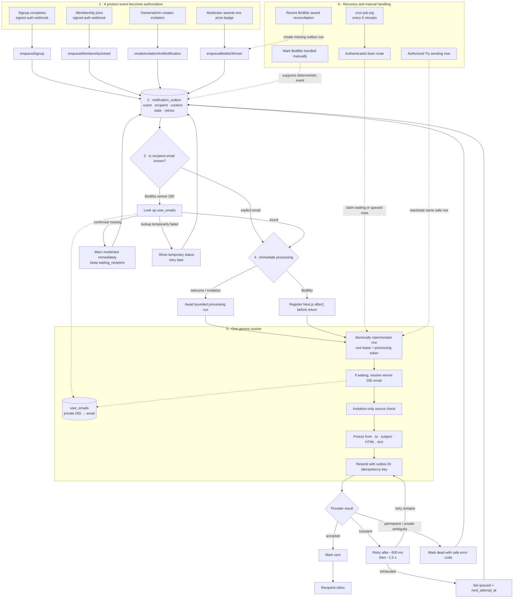

# Durable notification outbox plan

Status: reviewed implementation plan

## Scope

Build one private, durable email outbox for:

1. signup welcome after `user.signup.completed`;
2. organization-membership welcome after `organization.membership.joined`;
3. organization invitations; and
4. BioBlitz winner confirmation, one email per awarded prize.

Donation email is deferred because donations target organization accounts and the app does not have a reliable private organization-to-owner-email mapping.

## Core design

```text
Feature-specific producer
→ one private notification_outbox row
→ resolve and freeze exact recipient email
→ render and freeze complete provider request
→ attempt immediately
→ quick transient retries
→ durable retry in the same row
→ cron-job.org wakes the recovery route
```

The notification system adds one table: `notification_outbox`.

Existing private data remains separate:

- `user_emails` maps person DID to email;
- `cgs_group_invitations` stores invitations; and
- BioBlitz winner badges remain durable ATProto records.

## Decisions

- Sign-in and password-reset emails remain owned by the auth service.
- Healthy email is attempted immediately; scheduled draining is recovery only.
- One processing run makes the initial provider call plus up to two quick retries for transient failures.
- Resend receives the outbox row ID as its idempotency key.
- The sender, recipient, subject, HTML, and text are frozen before the first provider call. Retries never change them.
- Signup, membership welcome, and invitation save their trusted explicit email when enqueueing.
- BioBlitz saves the winner DID, immediately tries `user_emails`, and waits when the address is missing.
- Missing BioBlitz email warns the moderator immediately. **Mark handled manually** permanently stops automatic sending.
- The invitation email and post-join membership welcome are separate emails.
- Invitation creation succeeds independently of provider delivery.
- Authorized owners/admins can manually expedite a safe invitation retry without creating another invitation or outbox row.
- cron-job.org calls the authenticated recovery route every five minutes.
- If a provider timeout has an ambiguous outcome, retry only while Resend's verified idempotency guarantee remains valid. Stop afterward rather than risk a duplicate.

## Architecture



## Event-specific producer API

Callers cannot provide an arbitrary event type, recipient, or idempotency key. Each server-only producer derives those values and validates runtime input.

```ts
type EnqueueResult = {
  outboxId: string;
  duplicate: boolean;
  status: OutboxStatus;
};

type OutboxStatus =
  | "waiting_recipient"
  | "queued"
  | "processing"
  | "sent"
  | "suppressed"
  | "dead";

interface NotificationProducer {
  enqueueSignup(input: {
    authEventId: string;
    userDid: string;
    email: string;
    name?: string;
    locale?: string;
    createdAt?: string;
  }): Promise<EnqueueResult>;

  enqueueMembershipJoined(input: {
    authEventId: string;
    userDid: string;
    email: string;
    name?: string;
    locale?: string;
    organizationDid?: string;
    organizationName?: string;
    createdAt?: string;
  }): Promise<EnqueueResult>;

  enqueueBioblitzWinner(input: {
    roundId: number;
    roundLabel: string;
    prize: "most-observations" | "best-picture";
    winnerDid: string;
    observationCount?: number;
    winningObservationUri?: string;
    createdAt: string;
  }): Promise<EnqueueResult & {
    recipientStatus: "ready" | "missing_email" | "lookup_failed";
  }>;
}

interface InvitationNotificationService {
  createInvitationAndNotification(input: AuthorizedInvitationInput): Promise<{
    invitation: GroupInvitation;
    notification: NotificationSummary;
  }>;

  retryInvitationEmail(input: {
    invitationId: string;
    actorDid: string;
  }): Promise<NotificationSummary>;
}

interface BioblitzNotificationService {
  getPrizeNotification(input: {
    roundId: number;
    prize: "most-observations" | "best-picture";
  }): Promise<NotificationSummary | null>;

  markHandledManually(input: {
    roundId: number;
    prize: "most-observations" | "best-picture";
    moderatorDid: string;
  }): Promise<NotificationSummary>;
}

type NotificationSummary = {
  id: string;
  status: OutboxStatus;
  retryable: boolean;
  errorCode?: string;
  nextAttemptAt?: string;
};
```

The auth webhook keeps `createdAt` optional, matching its current contract. When absent, the app uses authenticated receipt time.

Stable event identities:

```ts
const eventKeys = {
  signup: (eventId: string) => `signup:${eventId}`,
  membershipJoined: (eventId: string) => `organization-membership-joined:${eventId}`,
  invitation: (invitationId: string) => `organization-invite:${invitationId}`,
  bioblitz: (roundId: number, prize: string, winnerDid: string) =>
    `bioblitz:${roundId}:${prize}:${winnerDid}`,
};
```

Store a SHA-256 digest as `event_key_hash`. Exact duplicate input returns the existing row. A conflicting type or identity under the same hash raises an idempotency-conflict error.

## One-table schema

```ts
type NotificationOutboxRow = {
  id: string;
  eventKeyHash: string;
  eventType: "signup" | "membership_joined" | "invitation" | "bioblitz_winner";
  payload: Json | null;
  sourceId: string | null;

  recipientDid: string | null;
  recipientEmail: string | null;

  templateKey: string;
  locale: string | null;
  frozenFrom: string | null;
  frozenTo: string | null;
  frozenSubject: string | null;
  frozenHtml: string | null;
  frozenText: string | null;
  frozenAt: string | null;

  status: OutboxStatus;
  nextAttemptAt: string;
  attemptCount: number;
  lockedUntil: string | null;
  processingToken: string | null;

  providerId: string | null;
  providerIdempotencyExpiresAt: string | null;
  ambiguousSince: string | null;
  lastErrorCode: string | null;
  lastErrorSummary: string | null;

  lastManualRetryAt: string | null;
  manualRetryCount: number;
  terminalAt: string | null;
  redactedAt: string | null;
  createdAt: string;
  updatedAt: string;
};
```

Required constraints:

- `event_key_hash` is unique.
- Signup, membership, and invitation rows require `recipient_email` immediately.
- BioBlitz requires `recipient_did`; email may be null only while `waiting_recipient`.
- `processing` requires a lease/token; every other state clears them.
- `sent` requires frozen sender, destination, subject, HTML, text, and `terminal_at`.
- `suppressed` and `dead` are terminal and ignored by cron.
- Browser roles cannot read or mutate the table or execute its RPCs.

Queue indexes:

```sql
create unique index notification_outbox_event_key_unique
  on notification_outbox (event_key_hash);

create index notification_outbox_due_idx
  on notification_outbox (next_attempt_at, created_at)
  where status in ('waiting_recipient', 'queued');

create index notification_outbox_expired_lease_idx
  on notification_outbox (locked_until)
  where status = 'processing';
```

Every RPC explicitly revokes execution from `PUBLIC`, `anon`, and `authenticated`, granting only `service_role`.

## One lease and one worker

The same lease handles recipient lookup and provider delivery. Immediate processing, cron, and manual invitation retry may race, but only one caller can claim a row.

```sql
update notification_outbox
set status = 'processing',
    locked_until = now() + interval '2 minutes',
    processing_token = :token,
    attempt_count = attempt_count + 1
where id = :outbox_id
  and (
    (status in ('waiting_recipient', 'queued') and next_attempt_at <= now())
    or (status = 'processing' and locked_until < now())
  )
returning *;
```

Batch claims use `FOR UPDATE SKIP LOCKED`. Commit before reading `user_emails`, rendering, or calling Resend. Every completion update requires the same token and clears the lease. A stale worker cannot overwrite a newer worker.

Worker shape:

```ts
async function process(row: ClaimedOutboxRow): Promise<ProcessResult> {
  if (row.statusBeforeClaim === "waiting_recipient") {
    const email = await lookupUserEmail(row.recipientDid);
    if (email.kind === "missing") return waitForRecipient(row);
    if (email.kind === "error") return retryLookup(row);
    row = await freezeRecipient(row, email.value);
  }

  if (row.eventType === "invitation") {
    const allowed = await invitationStillPendingAndUnexpired(row.sourceId);
    if (!allowed) return suppress(row, "invitation_not_pending");
  }

  row = await freezeCompleteProviderRequest(row);
  return sendWithQuickRetries(row);
}
```

Invitation suppression is guaranteed until the provider-call window begins. An invitation accepted or canceled after the request has already reached Resend cannot recall that in-flight email.

## Recipient handling

### Explicit email

Signup and membership email comes from the verified auth event. Invitation email comes from the authorized invitation request. Normalize and save it in the outbox row during enqueue.

### BioBlitz winner

Create the row with winner DID and `waiting_recipient`, then immediately process it.

Lookup outcomes:

- `ready`: save and freeze the email, then send;
- `missing_email`: warn the moderator immediately and leave the row waiting;
- `lookup_failed`: tell the moderator email preparation is temporarily unavailable and retry later.

Missing-email copy:

> The winner badge was awarded, but we do not have an email address for this person. They may need to be contacted manually.

There is no **Retry lookup** button; cron already retries. The moderator can choose **Mark handled manually**, which atomically marks the deterministic event `suppressed` and prevents future sending.

If badge creation succeeds but outbox creation fails, the award response reports `notification_setup_failed`. **Mark handled manually** works from the canonical round/prize/winner identity: it creates the deterministic outbox row directly in `suppressed` state. Later reconciliation therefore cannot create a sendable duplicate.

A moderator-authorized query joins each awarded prize to its notification summary so missing/failed state remains visible after page refresh.

## Templates and frozen request

Template source stays in code:

```text
lib/notifications/
├── types.ts
├── outbox.ts          # producers + repository RPCs
├── worker.ts          # recipient lookup + retries
├── provider.ts        # Resend/fake interface
└── templates/
    ├── shared-layout.ts
    ├── signup-completed.ts
    ├── membership-joined.ts
    ├── organization-invited.ts
    └── bioblitz-winner.ts
```

Translated copy is added to English, Spanish, Portuguese, Swahili, and Indonesian together.

Before the first provider call, the claimed worker:

1. runs the invitation-specific source check when applicable;
2. resolves the final email if needed;
3. maps the immutable event to a small render input;
4. sanitizes untrusted names and URLs;
5. renders the email; and
6. freezes `from`, `to`, subject, HTML, and text.

Every quick, durable, and manual retry sends that exact frozen request.

## Retry behavior

One processing run can make three provider calls:

```ts
const delaysBeforeProviderAttemptsMs = [0, 500, 1_500] as const;
const durableBackoffMs = [60_000, 300_000, 1_800_000, 7_200_000, 43_200_000] as const;
```

- Quick retry only network errors, timeouts, HTTP 408/429, and 5xx.
- Every provider call has an abort timeout.
- `Retry-After` controls `next_attempt_at` when longer than the quick window.
- Permanent failures become `dead` with an allowlisted code and redacted summary.
- A timeout after request transmission is ambiguous. Retry only while the verified Resend idempotency window remains active.
- After that window, stop rather than risk a duplicate.
- Provider work must finish before the database lease minus a safety margin.

Manual invitation retry is allowed only when the server marks the failure safe:

- allow expediting an ordinary queued retry;
- allow known provider rejection or failure before transmission;
- reject `sent`, `processing`, `suppressed`, and ambiguity outside the idempotency window.

The endpoint enforces the existing invitation-role permission matrix and a database cooldown.

## Feature flows

### Signup and membership welcome

```text
auth service
→ signed POST /api/internal/welcome-email-events
→ verify signature, timestamp, and event-specific payload
→ enqueue one outbox row with exact email
→ await one bounded processing run
→ return 2xx once durable, even if queued for retry
```

Preserve both existing event variants and their distinct templates.

### Organization invitation

One Supabase RPC creates the invitation and outbox row together after authorization/enrichment.

```text
owner/admin submits invitation
→ apply existing role rules
→ commit invitation + outbox row
→ await one bounded processing run
→ return invitation with delivery summary
```

Pending invitation email details are immutable:

- same organization/email/role returns the existing invitation/outbox row;
- changing role requires canceling and creating a new invitation;
- retry does not change expiry, address, or content.

Accepting, canceling, or expiring an invitation suppresses its unsent row. The worker checks the invitation immediately before freezing/sending.

Invitation UX:

**Sent**

> Invitation sent to person@example.com.

Pending row: **Waiting for them to join · Email sent**

**Temporary delivery problem**

> Invitation created. The email hasn’t been sent yet, but we’ll keep trying.

Pending row: **Email delayed**

Actions:

- **Try sending now**
- **Copy invitation link**
- **Cancel invitation**

**Cannot be retried safely**

> Invitation created, but we couldn’t send the email. You can copy the invitation link and share it directly.

Actions:

- **Copy invitation link**
- **Cancel invitation**
- **Try sending now** only when the server marks it safe

Copy warning:

> Only share this link with person@example.com.

Never show raw provider errors or say the invitation itself failed after it was created.

### BioBlitz

```text
round ends
→ no email
→ moderator awards one prize badge
→ enqueue deterministic outbox row
→ immediately try winner DID in user_emails
→ send immediately when ready, otherwise show recipient status
```

Each prize is independent. Notification failure never reverses a badge or blocks awarding the other prize.

Recent-award reconciliation joins canonical badge definitions and awards, identifies a missing deterministic outbox hash, and creates it without recalculating the winner. It scans only awards inside the 90-day deduplication window.

## Immediate processing in Next.js

`after()` is registered before returning and its callback returns the processing promise:

```ts
const queued = await producer.enqueueBioblitzWinner(input);

if (queued.status === "queued") {
  after(async () => {
    await worker.process(queued.outboxId, { deadline: routeDeadline });
  });
}

return Response.json(domainSuccess);
```

`after()` is only a fast path over durable state. If it is interrupted, cron recovery later claims the same row.

Welcome and invitation routes await one complete, deadline-bounded processing run, including quick retries.

## cron-job.org recovery

cron-job.org calls every five minutes:

```text
GET /api/internal/notifications/drain
Authorization: Bearer <NOTIFICATION_CRON_SECRET>
```

The route fails closed before database access when the secret is missing or mismatched. It:

1. claims due `waiting_recipient` or `queued` rows;
2. reclaims expired `processing` leases;
3. processes a bounded batch with bounded concurrency and provider timeouts;
4. stops before the Next.js function deadline;
5. releases claimed-but-unstarted rows; and
6. returns aggregate counts only.

Initial limits:

```ts
const DRAIN_BATCH_SIZE = 20;
const DRAIN_CONCURRENCY = 4;
const CRON_INTERVAL_MINUTES = 5;
```

The route is publicly reachable but authenticated. Manual actions use user/moderator authorization, not the cron secret.

## Privacy and retention

- Enable RLS; revoke browser table and RPC access.
- Keep Supabase, Resend, webhook, and cron secrets server-only.
- Never log email, payload, frozen content, signatures, or authorization headers.
- Store bounded redacted error summaries, never raw provider responses.
- `user_emails` is separate private account lookup data and is not affected by outbox cleanup.

Retention:

- `waiting_recipient`, `queued`, and `processing` may remain active for at most seven days.
- Sent rows erase recipient email, payload, and frozen content after seven days.
- Dead rows erase recipient email, payload, frozen content, and error detail after fourteen days.
- Redacted rows retain only event-key hash, event type, final status, and timestamps for 90 days.
- Delete the entire row after 90 days.
- BioBlitz reconciliation ignores awards older than 90 days so deleted rows cannot be recreated and resent.

A bounded cleanup RPC performs redaction/deletion.

## Observability and controls

Phase 1 includes:

- redacted structured logs using row ID, event type, status, attempt count, provider ID, and error code;
- queue counts and oldest due age;
- cron failure monitoring;
- per-producer enable flags; and
- one global `EMAIL_DELIVERY_MODE=disabled|capture|resend` switch.

A general operations dashboard is deferred. Product UI is limited to invitation status/actions and BioBlitz missing-email/manual-handling status.

## Implementation phases

### Phase 0 — baseline

- With explicit confirmation, rebase onto current `main` before implementation.
- Adopt current migration and translation conventions.
- Verify `user_emails` schema/synchronization and likely BioBlitz-winner coverage.
- Verify Resend's idempotency window.
- Configure cron-job.org and confirm route execution limits.

### Phase 1 — one-table outbox

- Add `notification_outbox`, indexes, constraints, RLS, secured RPCs, cleanup, and database tests.
- Add event-specific producers, one worker/lease, templates, Resend/fake provider, quick retries, and frozen requests.
- Add authenticated drain route, delivery modes, feature flags, queue health, and cron monitoring.
- If `main` has no database harness, add a local Supabase CLI stack and `pnpm test:db` contract-test command.
- Keep producers disabled.

### Phase 2 — welcome emails

- Migrate signup and membership-joined behind separate flags.
- Compare capture-mode output with current templates.
- Enable sending after parity and retry tests pass.

### Phase 3 — invitations

- Add transactional invitation + outbox RPC.
- Add suppression for acceptance/cancellation/expiry.
- Add clear sent/delayed/failed UX, safe **Try sending now**, copy link, and cancel actions.
- Update/add a `/_test` invitation experience using production components with mock persistence/provider adapters.
- Remove the old direct sender after parity.

### Phase 4 — BioBlitz

- Enqueue independently after each durable prize badge.
- Resolve winner DID immediately or through cron.
- Return `ready`, `missing_email`, `lookup_failed`, or `notification_setup_failed` to moderator UI.
- Add moderator notification query and deterministic **Mark handled manually**.
- Add recent-award reconciliation.
- Enable after duplicate, partial-success, missing-email, setup-failure suppression, and same-winner/two-prize tests pass.

### Phase 5 — cleanup

- Remove remaining direct app-owned Resend paths.
- Remove invitation compatibility fields only if no caller needs them.
- Add operator documentation and release notes.

No rebase, schema application, deployment, cron-job.org configuration, or external send happens without explicit confirmation.

## Validation

### Database

- Exact duplicate event returns the existing row; conflicting identity raises an error.
- Invitation and outbox commit together or not at all.
- Concurrent immediate/cron/manual claims produce one active lease.
- Expired leases are reclaimable; stale tokens cannot complete.
- RLS and RPC grants prevent browser access.
- Redaction and deletion follow terminal status windows.

### Worker

- Recipient and complete provider request freeze before first call.
- Every retry sends identical `from`, `to`, subject, HTML, and text with the same key.
- Transient failure makes at most three calls per processing run.
- Permanent errors skip quick retry.
- Ambiguous sends stop outside the verified provider window.
- Interrupted immediate processing remains cron-eligible.

### Welcome and invitation

- Repeated signup/membership webhooks each send only their intended email once.
- Invitation remains saved when provider delivery fails.
- Acceptance/cancellation/expiry suppress unsent rows, with the in-flight provider boundary documented.
- Retry follows role, safe error class, cooldown, and idempotency rules.
- UI copy/actions match sent, delayed, and cannot-send states.

### BioBlitz

- Round end alone sends nothing.
- Each awarded prize creates one row/email; one person winning both receives two.
- Missing email warns immediately and waits for later login/backfill.
- Temporary lookup failure is not misreported as missing email.
- Mark handled manually suppresses a current or not-yet-created deterministic event.
- Moderator state survives page refresh.
- Reconciliation does not duplicate or recreate events outside 90 days.

### Route and safety

- `after()` is registered before response and awaits its callback work.
- Invalid cron secret returns 401 before database access.
- Drain respects batch, concurrency, timeout, and deadline.
- Every user-facing string exists in all five languages.
- Local/test modes cannot call Resend.
- `/_test` uses production invitation components and mock adapters.

## Likely files

```text
docs/notification-outbox-plan.md
docs/notifications.md
supabase/migrations/*_notification_outbox.sql  # unless rebased main uses another convention
.env.local.example
lib/notifications/types.ts
lib/notifications/outbox.ts
lib/notifications/worker.ts
lib/notifications/provider.ts
lib/notifications/templates/**
lib/supabase/rest.ts
app/api/internal/notifications/drain/route.ts
app/api/internal/welcome-email-events/route.ts
app/_lib/cgs-invitations.ts
app/api/cgs/invitations/[invitationId]/retry-email/route.ts
app/(manage)/manage/groups/_components/GroupMembers.tsx
app/api/internal/bioblitz-awards/route.ts
app/%5Ftest/<invitation-experience>/**
messages/{en,es,pt,sw,id}/<notification namespace>.json
```

## Keep / replace / defer

### Keep

- Signed auth webhook and both welcome variants.
- Private `user_emails` lookup.
- Existing localized welcome/invitation content.
- Resend provider.
- Invitation/BioBlitz authorization.
- Stable event identity, one durable row, frozen request, one lease/token, quick retries, durable backoff, fake provider/clock, and bounded recovery.

### Replace

- Direct feature-level Resend calls.
- Provider failure being treated as invitation-creation failure.
- Mutable pending invitation content under one delivery identity.
- Generic caller-supplied event type/recipient/key.
- Retry behavior embedded in feature routes.

### Defer

- Provider delivery/bounce webhooks.
- General notification preferences.
- Marketing and multi-channel delivery.
- General operations dashboard.
- Explicit resend after an ambiguous request passes the provider idempotency window.
